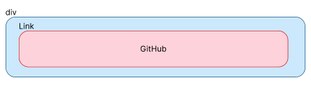

# Workshop Web dev. in NextJs & TailwindCSS

## What's Next.Js?

As stated on [Next.js](https://nextjs.org/) official documentation, Next.js is a react framework for building full-stack web applications. With Next.js, you can combine backend and frontend functionalities in one project. Next.js offers many other features like optimization, SEO(Search Engine Optimization) improvement, server-side, client-side components and so on. As this workshop focuses on giving you a basic understanding of Next.js and how components and some main features of front-end web development work, we're not going to state all the benefits of Next.js.  
However, if you're looking for more information, I invite you to look at the [Next.js](https://nextjs.org/) documentation page for more in-depth details.
These are some of the features we're going to cover in this workshop:  
`server components, client components, routing, data fetching`

## What's TailwindCSS?

Tailwindcss is a CSS framework for building modern web applications faster with the help of classes. [Tailwind](https://tailwindcss.com/) has a bunch of utility classes to help you setup your project and start building your web apps without worrying about CSS classes. Tailwind is also famous in web development because it's fully customizable. You can make your configurations according to your needs.


## Setting our environment
To be able to use next.js on your machine, you need to have [node.js](https://nodejs.org/en) installed.
To check if you have node.js installed, open a terminal or a command prompt(windows) and run the command:
```bash
node -v
```
If you get an Error, you'll need to download node:  
Linux:
```bash
sudo dnf install nodejs
```  
Else:  
Download node here [nodejs installation](https://nodejs.org/en/download).

## Getting started 🚀
To create a new app with next.js, follow these instructions:  
* Create a new folder and `cd` into that folder
* open your terminal and run the commmand:  
```bash
npx create-next-app@latest ./
```  
* You'll see the following prompts(use the arrow keys to select the options in parentheses):
```bash
ok to proceed? (y)
(No)  Would you like to use TypeScript? No / Yes
(No)  Would you like to use ESLint? No / Yes
(Yes) Would you like to use Tailwind CSS? No / Yes
(No)  Would you like to use `src/` directory? No / Yes
(Yes) Would you like to use App Router? (recommended) No / Yes
(No)  Would you like to customize the default import alias (@/*)? No / Yes
```
Congratulations :tada:!  
You have successfully created your (first) new next.js application.  

First, run the development server on your terminal:

```bash
npm run dev
```
Open [http://localhost:3000](http://localhost:3000) with your browser to see the result.

You can start editing the page by modifying `app/page.js`. The page auto-updates as you edit the file.  

## Configuration
To make our development process easy and straightforward, I have made a couple of configurations that you'll need to make this workshop easy for you.  
For now, we are going to change two files: `tailwind.config.js` and `app/globals.css`.  
You are going to delete the content of those two files and respectively replace it with this code:  

*tailwind.config.js*
```js
/** @type {import('tailwindcss').Config} */
module.exports = {
  content: [
    "./pages/**/*.{js,ts,jsx,tsx,mdx}",
    "./components/**/*.{js,ts,jsx,tsx,mdx}",
    "./app/**/*.{js,ts,jsx,tsx,mdx}",
  ],
  theme: {
    extend: {
      fontFamily: {
        inter: ["Inter", "sans-serif"],
      },
      colors: {
        "primary-green": "#C5F82A",
        "neutral-grey": "hsl(0, 0%, 20%)",
        "dark-grey": "hsl(0, 0%, 12%)",
        "off-black": "hsl(0, 0%, 8%)",
      },
    },
  },
  plugins: [],
};
```

*app/globals.css*
```css
@import url('https://fonts.googleapis.com/css2?family=Inter:wght@100..900&display=swap');

@tailwind base;
@tailwind components;
@tailwind utilities;

* {
  margin: 0;
  padding: 0;
  box-sizing: border-box;
  font-family: "Inter", sans-serif;
}

body {
  @apply bg-off-black font-inter text-white;
}

.profile, .center_elt {
  @apply flex justify-center items-center;
}

.img_wrapper {
  @apply w-[88px] h-[88px] relative;
}

.profileImg {
  @apply grid place-items-center; 
}

.card {
  @apply bg-dark-grey w-fit p-10 rounded-[14px];
}

.name {
  @apply font-bold text-white text-2xl mt-7 mb-2 text-center;
}

.location {
  @apply text-primary-green font-bold text-base -tracking-[0.45px] text-center;
}

.bio {
  @apply text-white text-sm -tracking-[0.42px] my-5;
}

.link_style {
  @apply py-[14px] w-full rounded-lg bg-neutral-grey text-center text-white font-semibold text-sm;
}

.socials {
  @apply flex flex-col gap-4;
}

.btn_navigation {
  @apply py-[14px] px-5 rounded-lg text-center font-semibold text-sm;
}

.active {
  @apply bg-[#CCC] text-neutral-grey;
}

.unactive {
  @apply bg-neutral-grey text-[#CCC];
}

.smooth_transition {
  @apply transition-all ease-in-out duration-500;
}

.advice {
  @apply font-bold text-[1.75rem] text-center tracking-[0.28px] text-white w-[503px] mt-9;
}
```
You don't need to worry about this code for now. This is just some predefined classes to speed up the development process. If you have any question, just ask your AER. We are officially done with the setting up, now let's make you a high skilled front-end developer :wink:.  

Open the **code editor** of your choice(I highly recommend vscode for web development).

## Extensions

Install the following extension to speed up your workflow:
1. **Auto Import**
2. **Prettier - Code formatter**
3. **Tailwind CSS IntelliSense**
4. **HTML CSS Support**
5. **Auto Rename Tag**

## File Structure
We'll mainly focus on the `/app` folder for this workshop.  
In your `/app` folder you should have this file structure:  
```
/
├── app/
│   ├── favicon.ico
│   └── global.css
│   └── layout.js
│   └── page.js
```
- The `global.css` is the file containing all your ``css`` styles for your project. You can also create another `css` file containing your styles but don't forget to `import` it in the **component** you're using it.  
- The `layout.js` define the layout of `root(\)` page. If you have noticed, most of web applications have multiple pages and each page share the same **navigation bar** and a **footer**. In `next.js`, you can set the layout of your pages with the help of the `layout.js` file.  
- The `page.js` define the actual content of your root page.

If you already have some `HTML` and `CSS` knowledge, just jump to the following [step](#components-in-nextjs).

## New devs
If you're new to web development, I invite you to carefully read these two pages as it will help you complete some steps in this workshop:
- [HTML introduction](https://www.w3schools.com/html/html_intro.asp)
- [CSS introduction](https://www.w3schools.com/css/css_intro.asp)
    - [CSS syntax](https://www.w3schools.com/css/css_syntax.asp)
    - [CSS selectors](https://www.w3schools.com/css/css_selectors.asp)

## Components in Next.js
Components are independant and reusable bits of code. They work the same as Javascript functions but instead of returning normal data, they return `HTML` code. To create a new component, follow these steps:  
1. Create a new folder at the root of your project called `/components`
2. Inside the `components` folder, create a new file with the name ``Button.jsx``
3. Inside the *Button.jsx* file, paste this code:
```jsx
import React from 'react'

export default function Button() {
  return (
    <div>Button</div>
  )
}
```
You've successfully created a new functional component :dizzy:!
> You can also install the [ES7+ React/Redux/React-Native snippets](https://marketplace.visualstudio.com/items?itemName=dsznajder.es7-react-js-snippets) extension if you're using **vscode** and type in your newly created file `rfc`, hit enter to create a new functional component.  

To use this component, you need to import it in a file you want to render the component using the ``import`` statement and specifying the path to that component. Components are used like *html* element but in a self closing tags.  
In this case:
```js
import Button from './path-to-the-component'


<Button />
```
Let's now modify the code of this component to be able to use it for our project.

In the return statement, write the following `HTML` structure:  


  


[Link](https://nextjs.org/docs/app/api-reference/components/link) element in **next.js**.


#### Example
  
is equivalent to this **HTML** structure:
```HTML
<div>
    <h1>First-name Last-name</h1>
    <p>I'm a web developer</p>
</div>
```
> Note that these images are visual representation of how your html looks like under the hood without the spacing around the text. To make it actually look like the images, you'll need some css properties.

Add these two *classes* to the *button* element: `btn_navigation smooth_transition`.  
To add a class to an element in `next.js`, use this syntax:
```HTML
<div className = "flex flex-col">...</div>
```
If you don't know what these classes do, you can hover over each of them in the `app/globals.css` and have some details.  
You can also visit the [Tailwind](https://tailwindcss.com/) documentation page for more information.  

#### Reusable component

Right now your component is like a static function. Whenever you use in another component or in a file, it'll render the same thing.  
In `Next.js` just like in `React.js`, you can make reusable components, working like functions with parameters.  
Remember that when you want to use code in your `html`, you have to surround it with curly brackets `{` `}`.  
Let see an example:  
Reusable component declaration
```js
import React from 'react'

export default function Eat({food}) {
  return (
    <h1>I'm eating {food}</h1>
  )
}
```
And when calling the component, you have to set the `props` that you passed to that component:
```js
import Eat from "path/to/Eat"

...
<Eat food = "banana" />
...

```
This will render on the page: `I'm eating banana`. You can then change the `food` variable according to your needs.

# Projrect structure
Follow the following steps to finish the setting up.  
- **Step1**  
Create a new component named `Navigation.jsx` and write this `HTML` structure:  

  
Add the following classes to the *nav* element: `mt-4 ml-9 flex gap-9`  
Import the `Button` component at the top the file.

- **Step2**  
Create a new component with the name `SocialLink.jsx`.  Write the following `HTML` structure:  

  
Add the `link_style` className to the `div` element.

- **Step3**  
Create a new component: `ProfileCard.jsx`. Once again, write the following `HTML` structure:  

  

Add these classes to the corresponding `HTML` element:  
* `profile` to the first `div` wrapping everything
* `card` to the second `div`
* `profileImg` to the third `div`
* `img_wrapper` to the fourth `div`
* `name` to the `h1` element
* `location` to the `h2` element
* `bio` to the `p` element
* `socials` to the `div` wrapping the `SocialLink` components.  

Add an picture of yourself in the `public` folder and use it in the [Image](https://nextjs.org/docs/app/api-reference/components/image) element.  

We are done with the first page of our workshop, congratulations on making it this far :sparkles:.  

---

Now it's your turn to practice your new next.js muscles by implementing the second page of our workshop by yourself. You can find a link below to what the next page should look like. If you need some help, you can always ask me.  

[Designs for the workshop](https://www.figma.com/file/QhzMSrXbykohpZrQkr0Kxf/Workshop-Nextjs%2BTailwind-CSS?type=design&node-id=0%3A1&mode=design&t=LpfGHkkU9LkOSdnw-1).


There are two more things I want to discuss about in this workshop, `routing` and `data fetching`.  

## Routing

[Routing](https://nextjs.org/docs/app/building-your-application/routing) is made very easy with `next.js 14` by using a file-based system for routes. To add a new page to your Web application, you just need to create a **new folder** with the same name of the ``route`` you want inside the `app` folder and create a new `page.jsx` file. That's how you create a new page in `next.js`.  

For instance, if I want to create a new page for ``blogs``, this is the file tree I should have:  

```
/
├── app/
│   ├── blogs/
│       └── page.jsx
│   └── favicon.ico
│   └── layout.js
│   └── page.js
```

## Data Fetching
For data fetching, I invite you to visit the official documentation of next.js.  
It is basically the same syntax we're using to retrieve data for the second page of our app.  


[Data Fetching](https://nextjs.org/docs/app/building-your-application/data-fetching/fetching-caching-and-revalidating) in `next.js`.

## Learn More

To learn more about Next.js, take a look at the following resources:

- [Next.js Documentation](https://nextjs.org/docs) - learn about Next.js features and API.
- [Learn Next.js](https://nextjs.org/learn) - an interactive Next.js tutorial.

## Additional resources for Web Development

- [W3schools.com](https://www.w3schools.com/) to learn HTML, CSS, JavaScript...
- [Frontend mentor](https://www.frontendmentor.io/home) to practice your front-end development skills and learn from a large community
- [JavaScript Mastery](https://www.youtube.com/@javascriptmastery) to learn **next.js** and other technologies.
- [Tailwind CSS tutorial](https://www.youtube.com/watch?v=tS7upsfuxmo)
- [CSS battles](https://cssbattle.dev/) to upgrade your skills in CSS.

## Deploy on Vercel

The easiest way to deploy your Next.js app is to use the [Vercel Platform](https://vercel.com/new?utm_medium=default-template&filter=next.js&utm_source=create-next-app&utm_campaign=create-next-app-readme) from the creators of Next.js.  


##### I hope you have enjoyed this workshop and you actually learned something new. Thank you for your efforts and participation :blush:.

